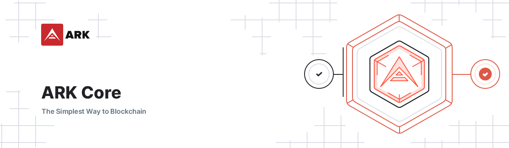

# Ark Core

    

## Introduction

This repository contains all plugins that make up the Ark Core.

## Documentation

-   Development : https://docs.ark.io/guidebook/core/development.html
-   Docker : https://docs.ark.io/guidebook/core/docker.html

## API Documentation

-   API v1 : https://docs.ark.io/archive/api/public-v1/ (Deprecated)
-   API v2 : https://docs.ark.io/api/public/v2/

## GitHub Development Bounty

-   Get involved with Ark development and start earning ARK : https://bounty.ark.io

## Core Packages

| Package                                                            | Version                                                                                                                                                | Description                          |
| ------------------------------------------------------------------ | ------------------------------------------------------------------------------------------------------------------------------------------------------ | ------------------------------------ |
| **[core](/packages/core)**                                         |                                              | **Includes all packages**            |
| [core-api](/packages/core-api)                                     |                                      | Public REST API                      |
| [core-blockchain](/packages/core-blockchain)                       |                        | Blockchain Managment                 |
| [core-container](/packages/core-container)                         |                          | Container Managment                  |
| [core-database](/packages/core-database)                           |                            | Database Interface                   |
| [core-database-postgres](/packages/core-database-postgres)         |          | Database Implementation - PostgreSQL |
| [core-debugger-cli](/packages/core-debugger-cli)                   |                    | Debugger CLI _(development only)_    |
| [core-deployer](/packages/core-deployer)                           |                            | Deployer CLI                         |
| [core-elasticsearch](/packages/core-elasticsearch)                 |                  | Elasticsearch Server                 |
| [core-error-tracker-bugsnag](/packages/core-error-tracker-bugsnag) |  | Error Tracking - Bugsnag             |
| [core-error-tracker-sentry](/packages/core-error-tracker-sentry)   |    | Error Tracking - Sentry              |
| [core-event-emitter](/packages/core-event-emitter)                 |                  | Event Emitter                        |
| [core-forger](/packages/core-forger)                               |                                | Forger Manager                       |
| [core-graphql](/packages/core-graphql)                             |                              | GraphQL Server                       |
| [core-http-utils](/packages/core-http-utils)                       |                        | HTTP Utilities                       |
| [core-json-rpc](/packages/core-json-rpc)                           |                            | JSON-RPC Server                      |
| [core-logger](/packages/core-logger)                               |                                | Logger Interface                     |
| [core-logger-winston](/packages/core-logger-winston)               |                | Logger Implementation - Winston      |
| [core-p2p](/packages/core-p2p)                                     |                                      | P2P Communication                    |
| [core-snapshots](/packages/core-snapshots)                         |                          | Snapshot Manager                     |
| [core-snapshots-cli](/packages/core-snapshots-cli)                 |                  | Snapshot CLI                         |
| [core-test-utils](/packages/core-test-utils)                       |                        | Test Utilities _(development only)_  |
| [core-tester-cli](/packages/core-tester-cli)                       |                        | Tester CLi _(development only)_      |
| [core-transaction-pool](/packages/core-transaction-pool)           |            | Transaction Pool                     |
| [core-utils](/packages/core-utils)                                 |                                  | Utilities                            |
| [core-vote-report](/packages/core-vote-report)                     |                      | Vote Report                          |
| [core-webhooks](/packages/core-webhooks)                           |                            | Webhook Server                       |
| [crypto](/packages/crypto)                                         |                                          | Cryptography                         |

## Security

If you discover a security vulnerability within this package, please send an e-mail to security@ark.io. All security vulnerabilities will be promptly addressed.

## Credits

-   [All Contributors](../../contributors)
-   [Alex Barnsley](https://github.com/alexbarnsley)
-   [Brian Faust](https://github.com/faustbrian)
-   [François-Xavier Thoorens](https://github.com/fix)
-   [Joshua Noack](https://github.com/supaiku0)
-   [Kristjan Košič](https://github.com/kristjank)
-   [Vasil Dimov](https://github.com/vasild)

## License

[MIT](LICENSE) © [ArkEcosystem](https://ark.io)
