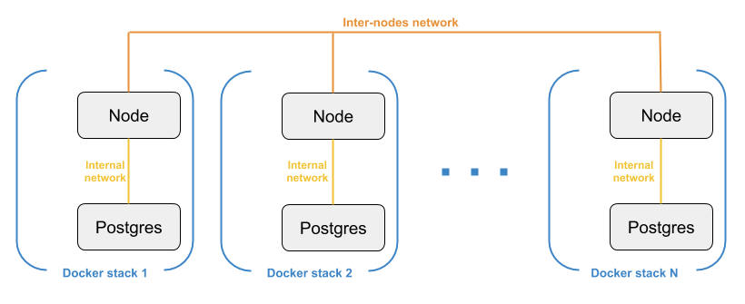

# Ark Core End-to-end Testing : technical details

## Introduction

Ark Core code is well-covered by unit tests, which is good to automatically identify bugs introduced by new code or refactoring.

But unit tests are limited to "simple" test cases. If we want to test how the Ark Core network behaves in the real-world, we need integration / end-to-end testing. This can be manual (devnet) or/and automated.

This project enables writing and running end-to-end tests by providing a simple framework. We will explain here how it all works.

## Architecture

### Docker

To be able to test the network in a real-world environment, we need to generate a number of nodes and make them interact with each other.

Here is a diagram showing how we leverage Docker _stacks_ and user-defined _overlay networks_ to have N independent nodes (each one has his own redis and postgres container) with a different IP assigned, interacting through standard ports (4000 / 4003), allowing to run a full network on one machine.

Now that we have defined this architecture, we need to provide a way to generate it and launch tests on it.

Note : this architecture uses docker swarm feature. In order to use it, we have to run first :

`docker swarm init`

### NodeJS app

The NodeJS app takes care of :

-   Generating and launching a network based on a user-defined configuration
-   Running a scenario (tests and actions) on the network

Here is the app structure :

-   **/bin** : Entry point for command-line interface.
-   **/lib** : App code
-   **/lib/config** : General configuration (currently only docker config).
-   **/tests/networks** : Networks configuration (genesis block, peers, ...). Each subfolder corresponds to a configured network.
-   **/tests/scenarios** : scenarios configuration (actions and tests to execute on the network). Each subfolder corresponds to a scenario.
-   **/dist** : Where the network is generated

There are two command-line endpoints :

-   `bin/e2e generate -n e2enet -c 3` To generate a network with the configured network _e2enet_ and 3 nodes.
-   `bin/e2e run-tests -n e2enet -s scenario1` To run the configured _scenario1_ on network _e2enet_ .

#### Generating the network

So what is `bin/e2e generate -n e2enet -c 3` really doing ?

It uses the _e2enet_ configuration in **/tests/networks** to generate the network in the **/dist** folder : for each node wanted (here 3 nodes), it will clone the Core repository into a specific folder.

If we run the command, this is the structure we would get inside **/dist** :

-   **/dist/e2enet** : Root folder for generated network, contains shell scripts and nodes subfolders
-   **/dist/e2enet/node0** : Core repository with _e2enet_ network configured and specific config for node0
-   **/dist/e2enet/node1** : same with config for node1
-   **/dist/e2enet/node2** : same with config for node2

Now to prepare the network on docker we would only need to :

    ./docker-init.sh && ./docker-start.sh

These scripts take care of docker configuring / building and launching the docker containers (with docker stack). After that, the network is ready to be started.

#### Running the scenario

`bin/e2e run-tests -n e2enet -s scenario1` will inspect what you configured inside **/tests/scenarios/scenario1/config.js**. Here is an example :

    module.exports  = {
      network: 'e2enet',
      enabledTests: [
        'doublespend1'
      ]
    }

This is the general config of your scenario : on which network it needs to be executed, and what are the enabled test cases : here only `doublespend1` is enabled : it means that there is a folder named `doublespend1` in the same folder as this `config.js` which contains one test case.

A test case typically contains some actions to be executed on the network (transactions for example), and some tests to check that the behavior is correct. Let's have a look at the `doublespend1` folder :

    0.transfer-new-wallet.action.js
    1.doublespend.action.js
    2.check-tx.test.js
    config.js
    utils.js

We can notice a few things here :

-   The test case steps are prefixed by a number for clarity
-   The _actions_ steps are suffixed by `action.js` and the _test_ steps are suffixed by `.test.js`
-   There is a configuration file `config.js` and a helper file `utils.js`

The engine will pick up the config and execute the actions and tests accordingly. The test results will then be displayed and if any test fail the application will terminate with exit code 1 (so that continuous integration tool can mark the build as failed).

More details on writing tests and how this is currently set up on our CI tool are available on the main README.md.

## Recap : what have we done ?

We managed to automate end-to-end testing running a predefined scenario (actions and tests) on a generated network.

Right now, it is as simple as :

    bin/e2e generate -n e2enet -c 3
    sudo chmod +x dist/e2enet/docker*
    cd dist/e2enet && ./docker-init.sh && ./docker-start.sh && cd ../..
    bin/e2e run-tests -n e2enet -s scenario1

And this can be integrated in any CI workflow.

## Going further

### Use multiple machines

Right now, this project runs the generated network on only 1 machine, but we could use Docker _Swarm_ to allow distributing the generated nodes on multiple machines.

### End-to-end testing on wallets, explorer...

We could apply the same method to have end-to-end testing on related applications (desktop / mobile wallet, explorer...). These applications have end-to-end testing but running on devnet, so we could instead run our own devnet so that we don't have external dependency on the actual devnet network. We could also set up a different custom network like e2enet to test the applications behavior on a custom network.

## Additional notes

### Decoupling network configuration and scenarios

I started with the idea that the network configuration should be independent from the tests and actions (so that we could choose one network and play any scenario on it). But going through I thought it makes more sense to have them linked because test results can depend on network configuration (for example minimumNetworkReach).

That's why the scenarios have now in `config.js` the network on which they depend. We could then get rid of all the `-n e2enet` options because the network is already defined in `config.js`.
